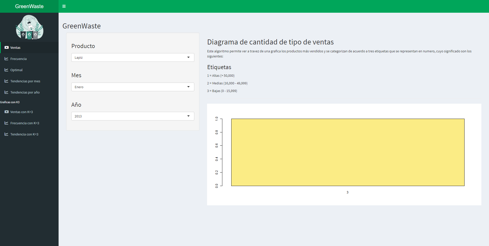
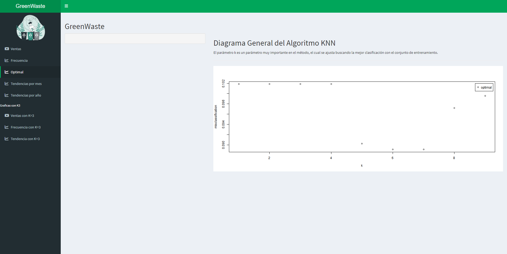
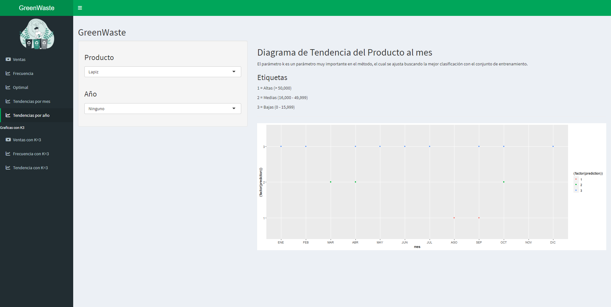

# GreenWaste
Sistema inteligente de recolección de basura con un modelo de negocio autosustentable. En términos generales es un sistema que consta de una aplicación móvil en la cual los usuarios podrán utilizar funciones para solicitar contenedores especializados para basura, notificar al servidor que el contenedor está lleno, conocer los puntos obtenidos por cada contenedor lleno que se entrega y canjear los puntos obtenidos por algunos regalos ofrecidos en la aplicación.

# Contenido
* App móvil *(Movil-App)*
* Panel web *(aplication_web)*
* Servicios web *(Service)*
* Panel administrativo *(DataMining - Machine Learning)*

## App móvil
Aplicación móvil desarrollada en flutter con conexión a servicios web a través de solicitudes https para administrar datos de usuarios, redimir recompensas, ver historial de puntos mensuales, registrar direcciones e inicios de sesión.

## Panel web
Panel de administrador para gestionar recompensas, usuarios, contenedores, materiales y premios, desarrollado en html con css, javascript y vuejs consumiendo servicios web.

## Servicios web
Servicios web estructurados para funcionar como una red de microservicios escritos en Java con conexión directa a la base de datos MySQL mediante conexiones asíncronas con implementación CORS.

## Panel administrativo
Generar un método que permita visualizar cuales son los premios que son menos reclamados por los usuarios que hacen uso de nuestra aplicación, de esa manera se pueden evitar pérdidas económicas que afecten el crecimiento de la app y por ende el cumplimiento de uno de nuestros objetivos, concientizar a la población a cuidar el medio ambiente que nos rodea, debido a que los usuarios pueden perder el interés en reclamar algunos de los premios por ser muy repetidos o porque no son necesarios para su uso.

Este panel fue desarrollado en R con librerías como ggplot2, kknn, RMySQL, DBI y shinydashboard, utilizando el algoritmo KNN (K-nearest neighbours), con el fin de realizar clasificaciones utilizando datos obtenidos de nuestra base de datos principal a un datawarehouse.

 
 
 
 
 

# Mockups
## Móvil
 
 
 

## Web
 
 
 
 
 
