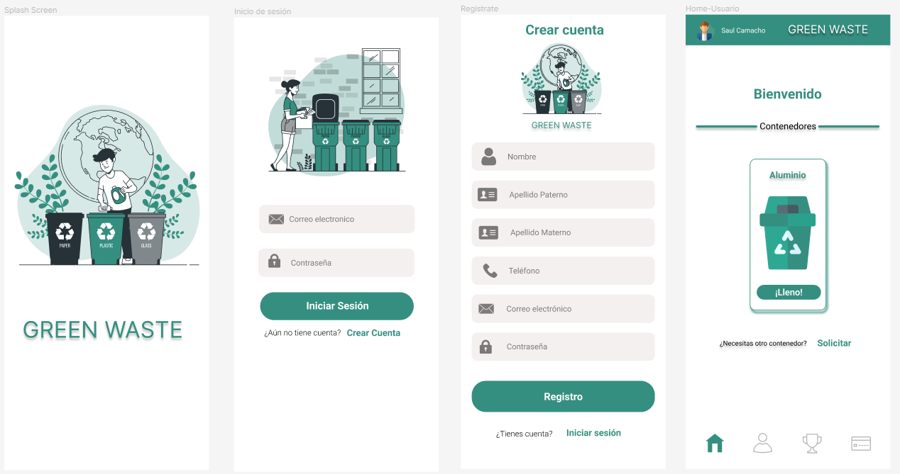
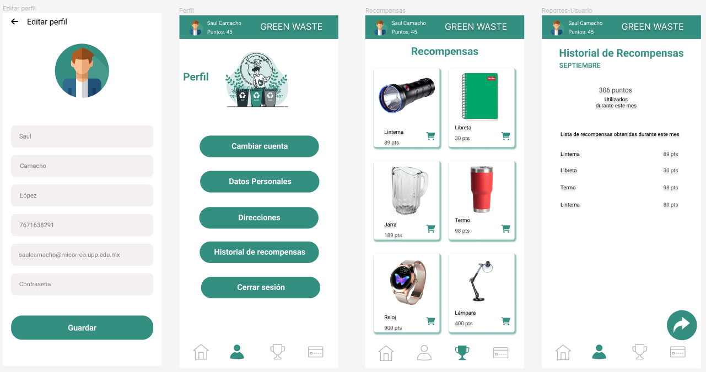
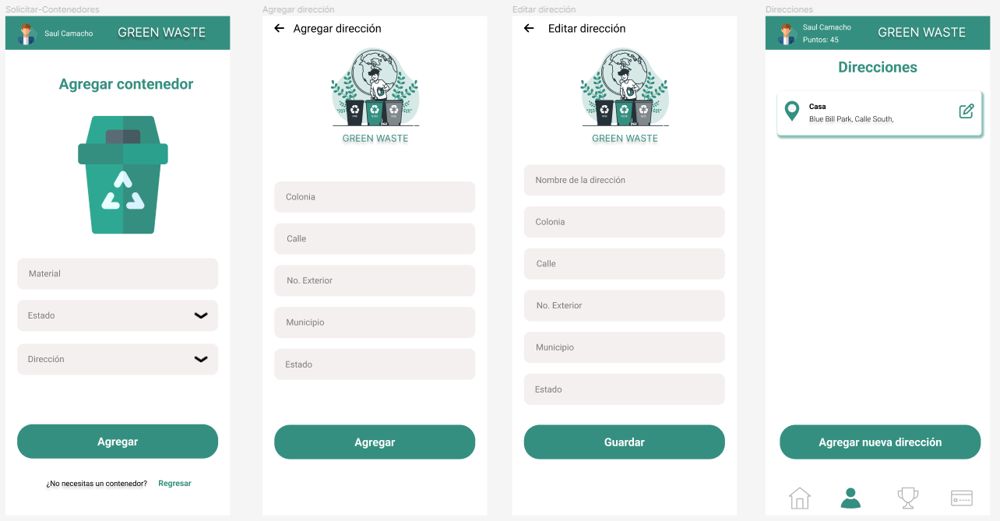
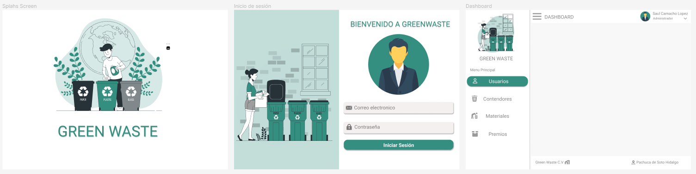
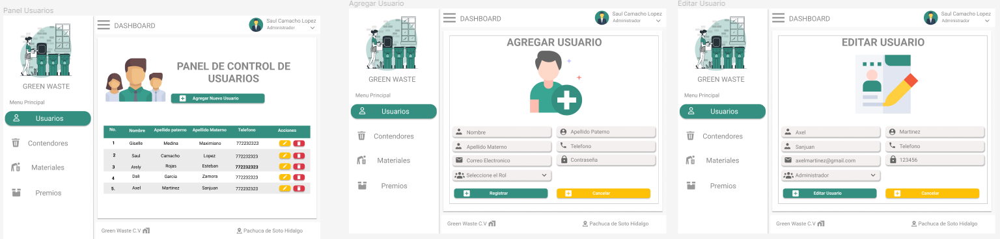
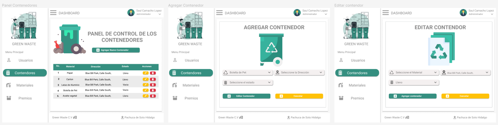
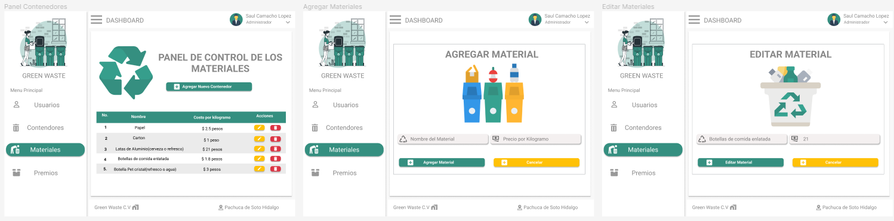
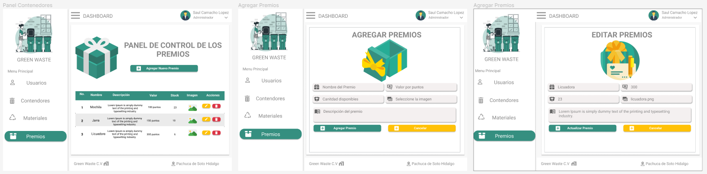

# GreenWaste
Sistema inteligente de recolección de basura con un modelo de negocio autosustentable. En términos generales es un sistema que consta de una aplicación móvil en la cual los usuarios podrán utilizar funciones para solicitar contenedores especializados para basura, notificar al servidor que el contenedor está lleno, conocer los puntos obtenidos por cada contenedor lleno que se entrega y canjear los puntos obtenidos por algunos regalos ofrecidos en la aplicación.

# Mockups
## Móvil
 
 
 

## Web
 
 
 
 
 
